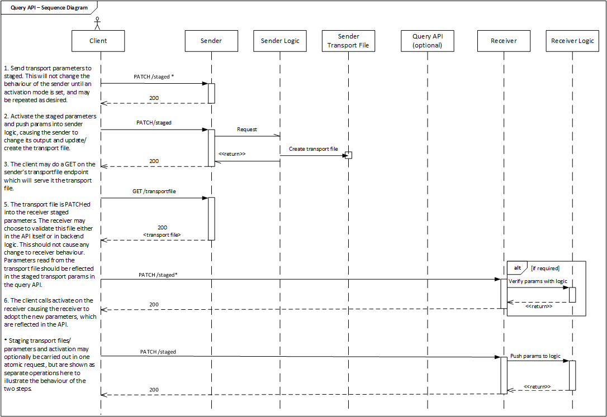

# **[Work In Progress]** AMWA Device Connection Management Specification

This repository contains details of this AMWA Specification for controlling aspects of NMOS Devices to effect connection management between Senders and Receivers.

## Getting started

Readers are advised to be familiar with:
* The JT-NM Reference Architecture (http://jt-nm.org/)
* The [overview of Networked Media Open Specifications](https://github.com/AMWA-TV/nmos)
* The [NMOS Discovery and Registration Specification](https://github.com/AMWA-TV/nmos-discovery-registration) (IS-04)

Readers should then read the [documentation](docs/) in this repository, and the [APIs](APIs/), which are written in RAML -- if a suitable tool is not available for reading this, then [this](APIs/generateHTML) will create HTML versions.

## Contents

* README.md -- This file
* [docs/](docs/) -- Documentation targeting those implementing APIs and clients.
* [APIs/](APIs/) -- Normative specifications of APIs
* [examples/](examples/) -- Example JSON requests and responses for APIs
* [LICENSE](LICENSE) -- Licenses for software and text documents
* [NOTICE](NOTICE) -- Disclaimer

## Usage

### Sequence Diagrams
When working with transport files it is possible to use the the API in one of two possible ways. The transport file may either be passed the the receiver by reference or directly. Where it is passed by reference the receiver is passed a URL pointing to the transport file. The receiver is then expected to retrieve the transport file itself.

The method of passing files by reference is preferred, as it allows the transport file to be directly accessed from its origin. The prevents the receiver being in possession of a stale copy.

In addition the API may be used with or without the NMOS query API. The work-flow when operating with the query API is slightly simpler but incurs the overhead of requiring a discovery and registration system.

Given below are two sequence diagrams that illustrate the various combinations of work-flow available for the API given these options.




### Un-initialised Senders and Receivers

When a sender or receiver is first started it may not have all the parameters it needs to operate. For example IP addresses and port numbers may not be set. In this instance:

* Senders and receivers should present sensible default values on transport parameter endpoints. Suggested defaults are given in the relevant schemas. Parameters such as port numbers may have defaults in various RFCs that should be followed. Parameters where no sensible defaults exist, such as source IP address on a receiver, should be set to null.
* Senders that are not configured (for example have a null source IP address value), should return 404 on their active transport file endpoint, until a usable set of parameters has been activated.

### Interaction with the Node API###

The Connection Management API supersedes the now deprecated method of updating the "subscription" parameter on Node API receivers in order to establish connection. The two methods of operation are likely to co-exist until Version 2.0 of TR-04. As such the following best practice should be followed when both are in use:

* Where a client updates the Node API subscription the result on connection management should be the same as if the client had first staged the parameters and then called an immediate activation. That is to say that the new parameters will be reflected both in the staged and active endpoints of the receiver.
* Where a client updates a Connection Management API receiver the active ```sender_id``` parameter should be populated in the Node API subscription parameter with key ```sender_id```.
* After a Connection Management API activation the corresponding sender's/receiver's ```version``` property should be updated to the instant of the activation.

### Stopping and Parking Senders and Receivers

In certain implementations it may be desirable to actively break the connection. This may be done in one of three ways:

* RTP senders and receivers have an ```rtp_enabled field```. This may be set to ```false``` to prevent the transmission or reception of RTP data.
* If it is desired to actively show that a connection no longer exists the source address on receivers and the destination address on senders may be set to null. Note that in the case of senders doing this should result in the active transport file endpoint returning a 404.
* Receivers may be disabled by activating a staged transport file resource where ```data``` has been set to null.
