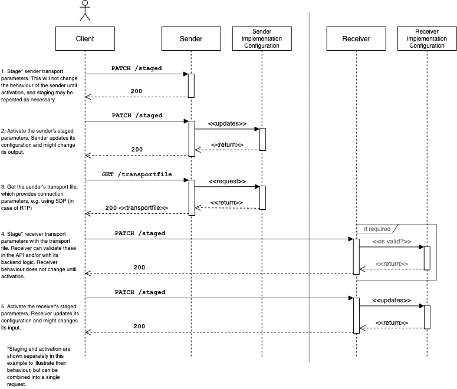

# AMWA NMOS Device Connection Management Specification: Overview

_(c) AMWA 2017, CC Attribution-NoDerivatives 4.0 International (CC BY-ND 4.0)_

## Documentation

The documents included in this directory provide additional details and recommendations for implementations of the defined API, and its consumers.

## Introduction

The purpose of this document is to explain how a Device within an NMOS compatible system can be connected to other Devices via their Senders and Receivers.

The terms 'Node', 'Device', 'Sender' and 'Receiver' will be used extensively throughout this document. Please refer to the core [NMOS Technical Overview](https://github.com/AMWA-TV/nmos/blob/master/NMOS%20Technical%20Overview.md) for definitions of these.

This API is intended to be used in conjunction with an [NMOS IS-04 Discovery & Registration](https://github.com/AMWA-TV/nmos-discovery-registration) deployment, however it has been written in such a way to provide useful functionality even in the absence of such a system.

## API Structure

The API provides a mechanism to change the settings associated with logical Senders and Receivers which abstract the implementations of different IP based transport protocols. The primary initial use case for this API is in the control of Senders and Receivers which implement the Real Time Protocol (RTP) transport type, but it is extensible to support control of other protocols as required and once defined.

### Resources

Each transport type implementation consists of a common set of paths as follows.

#### Constraints

Restrictions associated with each parameter which is defined for a given transport type. These are exposed on a per-Device basis and permit (for example) parameter values to be restricted to a set of valid IP addresses.

#### Staged

The staged endpoint provides the means to make changes to settings associated with a Sender or Receiver. These changes may be applied to the underlying implementation immediately, or at a time offset signalled in the HTTP request.

#### Active

The active endpoint reflects the current running configuration of the underlying Sender or Receiver. When a set of 'staged' settings is activated, these settings transition into the 'active' resource.

#### Transport File

Where a transport protocol is accompanied by file format which advertises connection parameters, this may be exposed via the 'transportfile' endpoint of a Sender. This provides the means to expose a Session Description Protocol (SDP) file in the case of RTP for example.

#### Transport Type

This endpoint identifies the transport type which is used by this Sender or Receiver. It is intended to enable disambiguation between the parameters sets which may be presented under the other resources.

### Single & Bulk Interfaces

The API provides a mechanism to modify settings for an individual Sender or Receiver. This is referred to as the 'single' interface.

The API also provides a mechanism to modify settings for many Senders or Receivers at once which sit within the scope of the API implementation (typically contained by a Node or Device). This is referred to as the 'bulk' interface.

The 'bulk' interface may be used to support specialist 'salvo' operations in capable Devices, as described in [Behaviour](4.0.%20Behaviour.md).

## API Interaction

The following sequence diagram shows the interactions between a client and the API.

