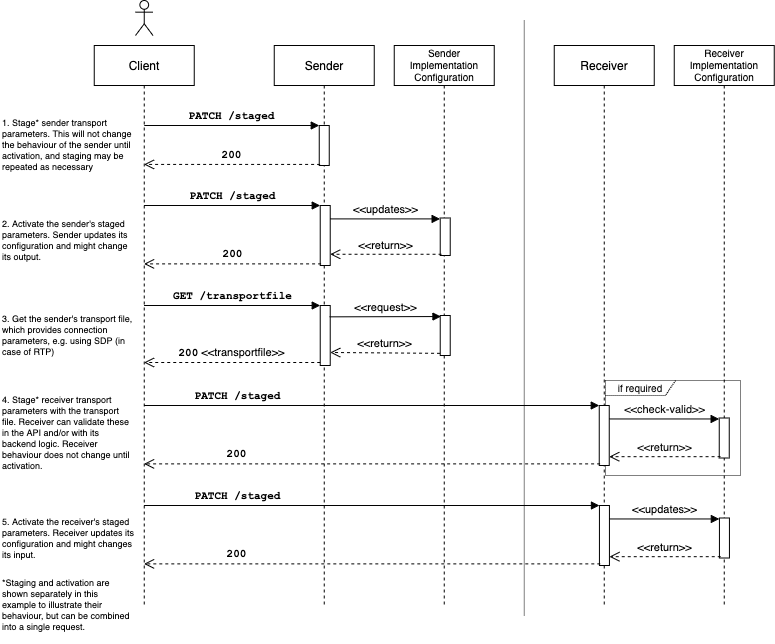

# AMWA IS-05 NMOS Device Connection Management Specification: Overview
{:.no_toc}

- A markdown unordered list which will be replaced with the ToC, excluding the "Contents header" from above
{:toc}

<!-- _(c) AMWA 2017, CC Attribution-NoDerivatives 4.0 International (CC BY-ND 4.0)_  -->

## Introduction

AMWA IS-05 specifies how to allow a Device in an NMOS compatible system to connect to other Devices, by means of the Devices' Senders and Receivers.

The Specification includes:

- RAML and JSON Schema definitions, with supporting JSON examples
- This documentation set, which provides:
  - An overview of the API and how it is used.
  - Normative requirements in addition to those included in the RAML and JSON schemas specifying the API.
  - Additional details and recommendations for implementers of API providers and clients.
  - Information about compatibility between different API versions.

IS-05 is intended to be used in conjunction with an [IS-04 NMOS Discovery & Registration](https://specs.amwa.tv/is-04) deployment; however it has been written in such a way to provide useful functionality even in the absence of such a system.

The terms 'Node', 'Device', 'Sender' and 'Receiver' are used extensively in this documenation set. The [NMOS Technical Overview](https://specs.amwa.tv/nmos/main/docs/2.0._Technical_Overview.html) provides an outline of these terms, and IS-04 provides corresponding schema definitions.

## Use of Normative Language

The key words "MUST", "MUST NOT", "REQUIRED", "SHALL", "SHALL NOT", "SHOULD", "SHOULD NOT", "RECOMMENDED", "MAY",
and "OPTIONAL" in this documentation set are to be interpreted as described in [RFC 2119][RFC-2119].

## API Structure

The API provides a mechanism to change the settings associated with logical Senders and Receivers which abstract the implementations of different IP based transport protocols. The primary use case for this API is in the control of Senders and Receivers which implement the Real Time Protocol (RTP) transport type. WebSocket and MQTT are supported since v1.1, and the API is extensible to support control of other protocols.

### Resources

Each Sender or Receiver implementation has a common set of paths as follows.

#### Constraints

The `/constraints` endpoint describes any restrictions associated with each parameter which is defined for a given transport type, and permit, for example, parameter values to be restricted to a set of valid IP addresses.

#### Staged

The `/staged` endpoint provides the means to make changes to settings associated with a Sender or Receiver. These changes can be applied to the underlying implementation immediately, or at a scheduled time signalled in the HTTP request.

#### Active

The `/active` endpoint reflects the current running configuration of the underlying Sender or Receiver. When a set of staged settings is activated, these settings transition from `/staged' into the `/active` resource.

#### Transport File

Where a transport protocol is accompanied by a file format which advertises connection parameters, this can be exposed via the `/transportfile` endpoint of a Sender. This provides the means to expose a Session Description Protocol (SDP) file in the case of RTP for example.

#### Transport Type

The `/transporttype` endpoint identifies the transport type which is used by this Sender or Receiver. It is intended to enable disambiguation between the parameter sets which can be presented under the other resources.

### Single & Bulk Interfaces

The API provides a mechanism to modify settings for an individual Sender or Receiver. This is referred to as the 'single' interface.

The API also provides a mechanism to modify settings for many Senders or Receivers at once which sit within the scope of the API implementation (typically contained by a Node or Device). This is referred to as the 'bulk' interface, and can be used to support 'salvo' operations in capable Devices, as described in [Behaviour](4.0.%20Behaviour.md).

## API Interaction

The following sequence diagram shows the interactions between a client and the API.

[RFC-2119]: https://tools.ietf.org/html/rfc2119 "Key words for use in RFCs"
